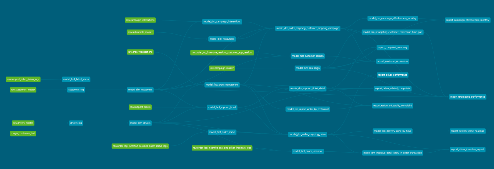

# LMWN Analytics Engineering Exam

## Project Overview

This project implements an analytics data modeling solution for a food delivery platform.  
The objective is to transform operational data into well-structured analytical datasets that support reporting across multiple business domains:

- Performance Marketing
- Fleet Management
- Customer Service

The solution follows a layered analytics engineering architecture designed to ensure modularity, data reliability, and scalable reporting workflows.

All models and reports are written back into the provided DuckDB database as required by the assignment.

---

## dbt Lineage

This project uses dbt for model development.  
Model dependencies and lineage can be visualized using dbt documentation.

To generate the lineage graph:

bash
dbt docs generate
dbt docs serve

# Tech Stack

| Tool | Purpose |
|---|---|
| DuckDB | Analytical database |
| SQL | Data transformation |
| Git | Version control |
| dbt-style modeling approach | Layered data modeling methodology |

---

# Data Architecture

The project follows a layered analytics engineering architecture:

Each layer serves a specific responsibility.

staging → data warehouse (dwh) → data mart (dm) → reports

| Layer         | Purpose                                                           |
|---------------|-------------------------------------------------------------------|     
| staging       | Prepare dimension updates and SCD Type 2 preprocessing            |
| dwh           | Canonical dimensional model with reusable facts and dimensions    |
| dm            | Business-oriented aggregated datasets                             |
| reports       | Final analytical datasets used by business teams                  |

This layered approach ensures:

- separation of transformation responsibilities
- reusable datasets
- maintainable analytical pipelines
- scalable reporting workflows

---

# Data Model

## Staging Layer

The staging layer prepares dimension updates before loading them into the warehouse layer.

This layer is mainly responsible for:

- preprocessing dimension updates
- preparing Slowly Changing Dimension (SCD Type 2) logic
- structuring incoming data before warehouse ingestion

Example staging tables:
staging.customers_stg
staging.drivers_stg

These tables act as a transformation buffer to prepare dimension changes before they are materialized into warehouse dimension tables.

---

# Data Warehouse Layer (dwh)

The warehouse layer contains reusable **dimension and fact tables** forming the canonical analytical dataset.

Downstream marts and reports rely on this layer as the trusted data source.

---

## Dimensions

dwh.model_dim_customers
dwh.model_dim_drivers
dwh.model_dim_restaurants
dwh.model_dim_campaign

Dimensions store descriptive attributes used across analytical models.

Examples include:

- customer profile information
- driver attributes
- restaurant information
- campaign metadata

### Slowly Changing Dimension (Type 2)

Customer and other dimensions are implemented using **SCD Type 2** to preserve historical attribute changes.

Dimension updates are prepared in the staging layer before being inserted into warehouse tables.

This enables historical tracking of attribute changes over time.

---

## Fact Tables

dwh.model_fact_order_transactions
dwh.model_fact_order_status
dwh.model_fact_campaign_interactions
dwh.model_fact_customer_session
dwh.model_fact_driver_incentive
dwh.model_fact_support_ticket
dwh.model_fact_ticket_status

Fact tables capture business events across the platform.

| Fact Table                    | Description                   |
|-------------------------------|-------------------------------|
| fact_order_transactions       | order-level transactions      |
| fact_order_status             | order lifecycle events        |
| fact_campaign_interactions    | campaign interaction events   |
| fact_customer_session         | user session activity         |
| fact_driver_incentive         | driver incentive participation|
| fact_support_ticket           | customer support issues       |
| fact_ticket_status            | support ticket status history |

---

# Incremental Processing Strategy

Fact tables are implemented as **incremental models**.

To handle late-arriving data, records with `event_date` within the **previous 3 days** are allowed to be reprocessed.

Incremental logic example:

event_date >= current_date - 3

During each run:

- recent records within the last **3 days** are reprocessed
- existing records are **upserted**
- new records are **inserted**

Benefits:

- supports late-arriving events
- improves pipeline efficiency
- avoids full table rebuilds
- maintains data accuracy

---

# Data Mart Layer (dm)

The data mart layer contains business-oriented datasets optimized for reporting.

dm.model_dm_campaign_effectiveness_monthly
dm.model_dm_delivery_zone_by_hour
dm.model_dm_support_ticket_detail
dm.model_dm_order_mapping_customer_mapping_campaign
dm.model_dm_order_mapping_driver
dm.model_dm_repeat_order
dm.model_dm_repeat_order_by_restaurant
dm.model_dm_retargeting_customer_conversion_time_gap
dm.model_dm_incentive_detail_show_in_order_transaction

Examples of logic implemented in this layer:

- marketing attribution
- repeat purchase behavior
- driver delivery performance
- delivery zone aggregation
- complaint enrichment
- incentive participation analysis

These models prepare datasets specifically for report generation.

---

# Reporting Layer

The reporting layer contains the final datasets used by business teams.

reports.campaign_effectiveness_monthly_report
reports.customer_acquisition_report
reports.retargeting_performance_report
reports.driver_performance_report
reports.delivery_zone_heatmap_report
reports.driver_incentive_impact_report
reports.complaint_summary
reports.driver_related_complaints_report
reports.restaurant_quality_complaint_report

Each report corresponds to a specific business use case.

---

# Implemented Reports

## Performance Marketing

### Campaign Effectiveness Report

Measures campaign performance including:

- impressions
- clicks
- conversions
- campaign spend
- attributed revenue
- return on ad spend (ROAS)

---

### Customer Acquisition Report

Analyzes campaign effectiveness in acquiring new customers.

Metrics include:

- number of first-time customers
- average purchase value
- repeat purchase behavior
- time from interaction to first purchase
- acquisition cost
- channel/platform segmentation

---

### Retargeting Performance Report

Evaluates retargeting campaigns designed to re-engage existing customers.

Metrics include:

- targeted customers
- returning customers
- returning rate
- revenue from retargeted users
- time gap between original and returning orders
- retention after returning

---

# Fleet Management Reports

### Driver Performance Report

Measures driver performance:

- assigned vs completed deliveries
- job acceptance rate
- average delivery time
- delayed deliveries
- customer feedback

---

### Delivery Zone Heatmap Report

Analyzes delivery efficiency by geographic zone.

Metrics include:

- delivery volume
- completion rate
- average delivery time
- rejection/cancellation rates
- supply vs demand ratio

---

### Driver Incentive Impact Report

Evaluates incentive program effectiveness.

Metrics include:

- driver participation
- completed deliveries during incentive periods
- acceptance rate changes
- incentive payouts
- operational efficiency improvements

---

# Customer Service Reports

### Complaint Summary Dashboard

Provides high-level overview of support issues.

Metrics include:

- total complaints
- complaint categories
- average resolution time
- unresolved tickets
- compensation issued
- complaint trends

---

### Driver Related Complaints Report

Analyzes driver-related complaints.

Metrics include:

- complaints per driver
- complaint categories
- resolution time
- complaint-to-order ratio

---

### Restaurant Quality Complaint Report

Analyzes restaurant-related complaints.

Metrics include:

- complaints per restaurant
- complaint categories
- resolution time
- compensation issued
- complaint-to-order ratio
- impact on repeat purchases

---

# Data Quality Testing

Data quality tests are implemented at the **Data Warehouse (dwh) layer**.

Tests include:

- Not Null Tests
- Duplicate Key Tests

These validations ensure:

- primary identifiers exist
- fact and dimension records remain unique
- downstream models rely on trusted datasets

---

# Assumptions

Some analytical metrics require assumptions.

Examples:

Customer acquisition

first purchase attributed to a campaign

Returning customer

customer who places an order after interacting with a retargeting campaign

Retention after retargeting

customer places additional orders after returning

ROAS calculation

ROAS = attributed_revenue / campaign_spend

---

# Future Improvements

## Enhanced Data Quality Monitoring

To further improve the reliability of the pipeline, additional data quality mechanisms could be implemented in the staging layer.

### Duplicate Record Logging

Duplicate records could be detected during staging transformations and stored in a dedicated log table.

Example:

dq_log_duplicate_records

Example fields:

- pipeline_run_id
- source_table
- business_key
- duplicate_count
- detected_timestamp

---

### Business Rule Validation

Business rule validation could detect invalid records before warehouse loading.

Examples:

| Validation Rule           | Description                |
|---------------------------|----------------------------|  
| NULL key fields           | Detect missing identifiers |
| end_date < start_date     | Invalid date ranges        |
| negative numeric values   | Invalid business metrics   |
| invalid status values     | Domain value violations    |

Example error log table:

dq_log_business_errors

---

### Data Quarantine Strategy

Invalid records could be isolated using a data quarantine strategy.

Pipeline behavior:

raw data
↓
staging validation
↓
clean records → warehouse (dwh)
error records → dq_error_tables

This ensures only validated data enters analytical datasets.

---

### Monitoring and Alerting

Future improvements could include monitoring data quality metrics such as:

- duplicate record rate
- error record rate
- missing key fields
- abnormal metric values

Alerts could notify data engineers when thresholds are exceeded.

---

### Data Freshness Monitoring

Future implementations may include data freshness monitoring:

- delayed ingestion detection
- missing partition detection
- SLA validation for reporting datasets

---

### Data Lineage Tracking

Automated lineage tracking could improve maintainability by showing upstream dependencies between staging, warehouse, marts, and reports.

---

# Conclusion

This project demonstrates a structured analytics engineering workflow including:

- layered data architecture
- dimensional modeling
- SCD Type 2 dimension handling
- incremental fact processing with late-arriving data support
- reusable data marts
- business-ready reporting datasets

The architecture emphasizes scalability, maintainability, and analytical reliability.
